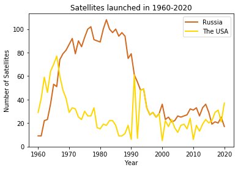
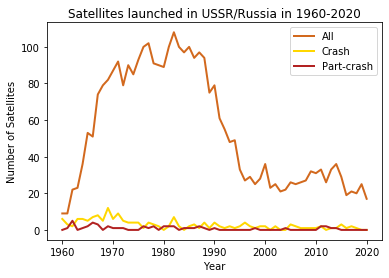
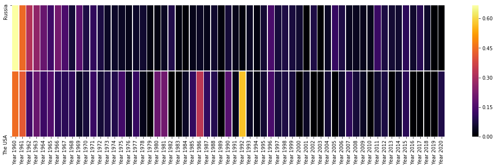
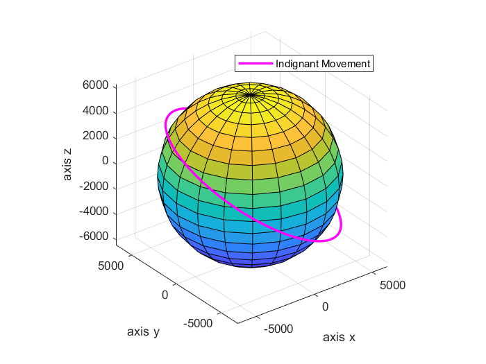

# Atmospheric disturbances
## Can a satellite fall to Earth?
*If you was ever wondering how this happens, you should read this blog. This paper is for people who is interested in space or maybe even wants to study space flight mechanics and understand fundamental processes happening in space.*

So, the answer is "yes". Why is this happening? Let's talk about launching satellites first.

Every year, countries launch dozens of satellites. Below are the statistics of satellite launches by two world leaders - the USSR / Russia and the USA and the number of launched/crashed/partly-crashed russian satellites over the past 60 years (1960-2020) [1].
 
 

The probability that a satellite would crash is shown in the following diagram.

Let's look at one of the possible reasons for the fall of a satellite from orbit to the Earth and consider how satellites fly in general.

To begin with, the satellite is kept in orbit under the influence of the gravitational field of the attracting center (in our case, the Earth). The unperturbed movement of the apparatus assumes the complete absence of any disturbances (the gravitational field is central, the atmosphere is not taken into account, there are no other objects in outer space). The apparatus moves in an elliptical orbit (a circle, as we know from the course of Linear Algebra, is a special case of an ellipse). In real conditions, this, of course, is impossible, but more on that later.

There is no coordinate system in the world in which the movement of any object could be fully described. When solving problems, absolutely different coordinate systems can be used. One of the ways in which one can uniquely describe the position of the orbit in space and its geometry is by using Keplerian elements [2]. Keplerian elements are 6 independent elements: the argument of pericenter, which characterizes the orientation of the orbit in its plane, the semi-parameter and eccentricity, which uniquely determine the geometry of the orbit, the longitude of the ascending node and the inclination, which determine the position of the orbit in space and the transit time through the pericenter.

With undisturbed motion of the apparatus, the Keplerian elements remain constant (i.e., the apparatus returns to the same point from which it began to move). In reality this model is impossible. The apparatus is affected by many different forces - the non-centrality of the gravitational field (because the Earth is not spherical), solar heating, the gravitational force of the Moon, Sun, Jupiter (the more elements are considered, the more complex the model), atmospheric resistance. The more accurate the result is required, the more complex the gravitational field model is used. The Earth, for example, can be viewed as a biaxial ellipsoid of revolution or as a geoid; when calculating, we can limit ourselves only to the influence of the Moon, but we can take into account the Moon, the Sun, Jupiter and Saturn, and so on. We will not artificially complicate our task, of course.

Let's return to our question. The perturbation that can lead to a satellite entering a critical orbit - an orbit in which the satellite makes only one revolution around the Earth and falls - is caused by atmospheric resistance. The main disturbing factor is the drag vector directed against the velocity vector. The main argument is the density of the atmosphere. The density of the atmosphere is a complex model that depends on many factors (height from the Earth's surface, time of day, level of solar activity, etc.) [4]. There are many different models of the atmosphere.

## Still not very clear how it works? 
Let's imagine what the satellite is "experiencing". When you drive a car, the vector of speed is directed in one direction, and the vector of drag is in the other direction. If you stick your hand out of the window, you will feel it being pushed back. Moreover, the higher the speed, the stronger the feeling is. Have you presented? So, the same is experienced by the satellite, being in orbit.

What happens to the orbit under the influence of atmospheric disturbances? The orbit is an ellipse, what is a locus of points M of the Euclidean plane, for which the sum of the distances to two given points, called focuses, is constant [5]. According to Kepler's first law [6], the attracting center is in focus. The question to you is: in which of the two focuses is the attracting center - on the right or on the left? While you're thinking, let's go back to orbit. The smallest distance from the point of the orbit to the attracting center is called the height of the pericenter, the largest is the height of the apocenter. Under the influence of atmospheric disturbances, the orbit tends to become circular, that is, the height of the apocenter decreases more than the height of the pericenter. At the apocenter, the apparatus undergoes impulse inhibition [7]. So, what about the tricks? As I already said, there is no coordinate system in the world that uniquely defines what is “right” and what is “left”. Everything depends on the observer; therefore, the attracting center is in any of the focuses.

Is the influence of the atmosphere so strong that any satellite can disable them? Both yes and no. The atmospheric drag is significant in Low Earth Orbits(LEO) which is 200 km - 2000 km, in higher orbits the atmospheric drag can be neglected.

## How can any indignation be taken into account? 
There are several methods, one of which is the osculating element method [8]. If we imagine that at every moment of time all perturbations cease to act on the apparatus, we get a system of Keplerian orbits. We can imagine a real orbit as the envelope of a family of Keplerian orbits. The orbital parameters cease to be constant, i.e., they change over time. We get 6 differential equations that cannot be integrated. All parameters depend on the components of the perturbing acceleration - normal, transverse and binormal. Under the influence of atmospheric disturbances, the normal and transverse components are in the orbital plane, and the binormal component is perpendicular. It is generated by the rotation of the atmosphere. The more disturbing factors we want to take into account, the more expressions for determining the components of the disturbing acceleration we will receive.

## What to do with the fact that the system cannot be integrated? 
### How do you get solutions? 
There are many different numerical methods for solving a system of differential equations, for example, the Euler method or the Runge-Kutta method. We get a curve that is closest to the real orbit of the spacecraft.

Thus, it is precisely because of the influence of atmospheric drag that the satellite can fall.

## References
1. Wikipedia. [Timeline of Spaceflights.](https://en.wikipedia.org/wiki/Timeline_of_spaceflight)
2. David A. Vallado. Fundamentals of Astrodynamics and Applications, 2013.
3. Kleomenis Tsiganis, Harry Varvoglis. [Quasi-critical orbits for artificial lunar satellites, 2009.](https://www.researchgate.net/publication/225586921_Quasi-critical_orbits_for_artificial_lunar_satellites)
4. [NASA Glossary.](https://www.grc.nasa.gov/www/k-12/TRC/laefs/laefs_a.html#atmospheric_pressure)
5. Wikipedia. [Ellipse.](https://simple.wikipedia.org/wiki/Ellipse)
6. NASA. [Kepler's laws of planetary motion.](https://solarsystem.nasa.gov/resources/310/orbits-and-keplers-laws/)
7. Morozova TA. Space Flight Mechanics for University, 2017
8. European Space Agency. [Osculating elements.](https://gssc.esa.int/navipedia/index.php/Osculating_Elements)
